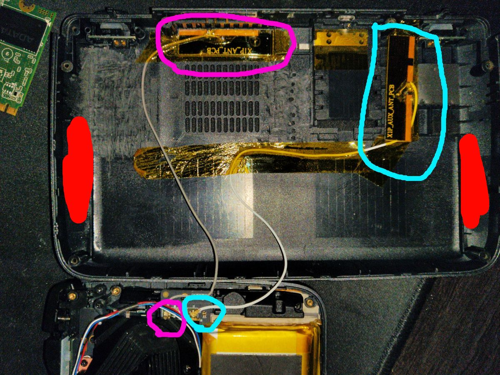

The WiFi antennas in the GPD Win 2 are poorly placed - located roughly under
where one would grip the device with their palms. This results in noticeably
degraded performance when holding the... handheld device.

I replaced the stock antennas with
[a pair of MHF4 antennas](https://www.amazon.com/gp/product/B07DB6ZG3B/ref=ppx_yo_dt_b_asin_title_o07_s00?ie=UTF8&psc=1)
and installed them in _saner_ locations.

Red lines mark roughly the location of the original antennas while pink and cyan
mark the location of the main and aux antennas respectively. 

I don't have metrics for the old antennas as I did this mod only after accidentally damaging them.
However, the new antennas are noticeably better - achieving
three bars of strength in spots of my house where the stock antennas reach one to two bars. More importantly,
**my grip no longer degrades speed nor strength of signal.**

Seeing ~500Mbps download/upload when the device is held next to my router and ~180Mbps download/upload
in the spots which have the weakest signal.
