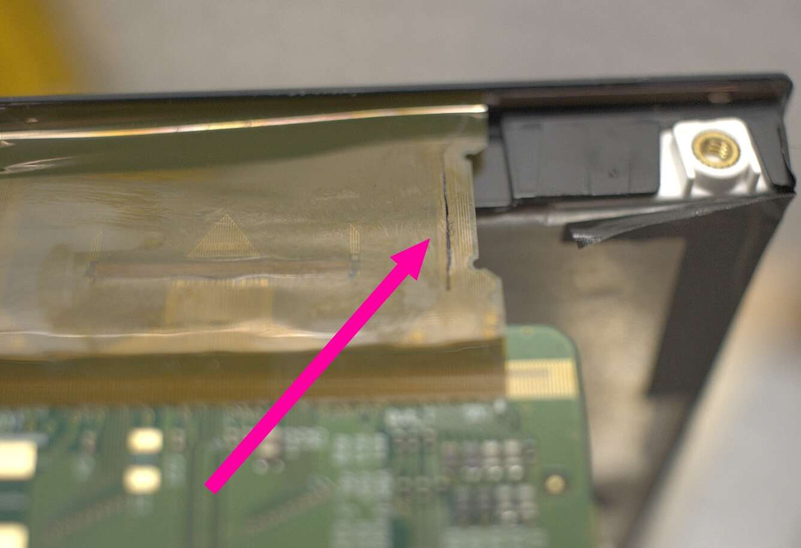

The [LG 34GK950F-B](https://www.lg.com/us/monitors/lg-34GK950F-B-gaming-monitor)
monitor I purchased in May 2019 has died. Its fate is the "horizontal lines" issue that many others have reported [[1]](https://www.amazon.com/LG-34GK950F-B-34-21-Ultragear/product-reviews/B0798Q8KG4/ref=cm_cr_arp_d_viewopt_kywd?ie=UTF8&reviewerType=all_reviews&pageNumber=1&filterByKeyword=lines).

This is not what a $799 display should look like, but here we are.

## Onset
While using the display, it randomly made a buzzing sound as horizontal lines appears on the display - still usable albeit
in a degraded state. A few seconds later, the entire display turned into the picture above - completely unusable.
There was a loud buzzing sound from the lower right of the display throughout all of this.

## Analysis
There were no signs of damaged components on the PCBs as I gradually disassembled the display.
Only when I reached the panel did I notice something off - one of the ribbons connected
to the panel looked different than the others.

The display is upside down in this picture. The pink arrow corresponds to the
location where I initially heard the buzzing sound.

The problem.

Under a microscope, I can clearly see that **ribbon cable caught on fire at some point**.

## Outcome
I don't know of a way to repair this. The ribbon cable is directly connected to the PCB and, seemingly, the LCD.
A hot air reflow tool might help with the PCB, but I'm not certain it would with the LCD.

Honestly, I feel ripped off. $799 for a monitor only to have it break in less than two years of **normal use**.
Worse, I'm concerned about the safety implication this poses to others suffering from the same problem.
