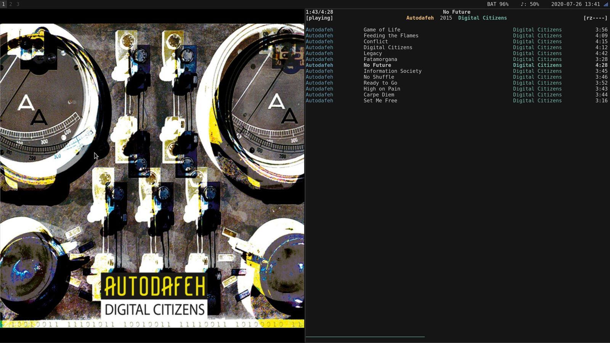

I love using [ncmpcpp](https://github.com/ncmpcpp/ncmpcpp) to control MPD music playback.
It's lightweight, simple, and does everything I need with one exception - displaying
cover art. After recently starting to learn [PyGObject](https://pygobject.readthedocs.io/en/latest/)
for PinePhone app development, it became clear that I could also use PyGObject to fill this need.

Thus, [mpd-art-box](https://github.com/nvllsvm/mpd-art-box) was created. Nothing fancy - just 127 lines of Python
which creates a window showing local cover art for the currently playing song in MPD. 

The result looks great, especially when sharing a split [i3](https://i3wm.org/) layout with ncmpcpp.

It's still a kind of rough around the edges, but I'm very pleased how quick it was to create and how little code there is to maintain.

See the source repository for more information: [GitHub - nvllsvm/mpd-art-box](https://github.com/nvllsvm/mpd-art-box)
