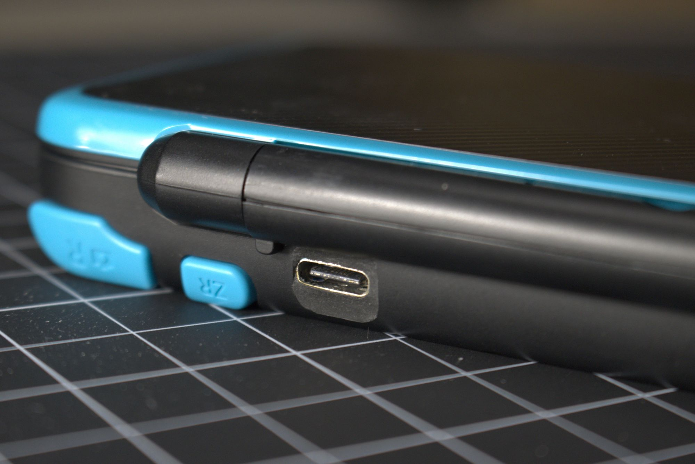
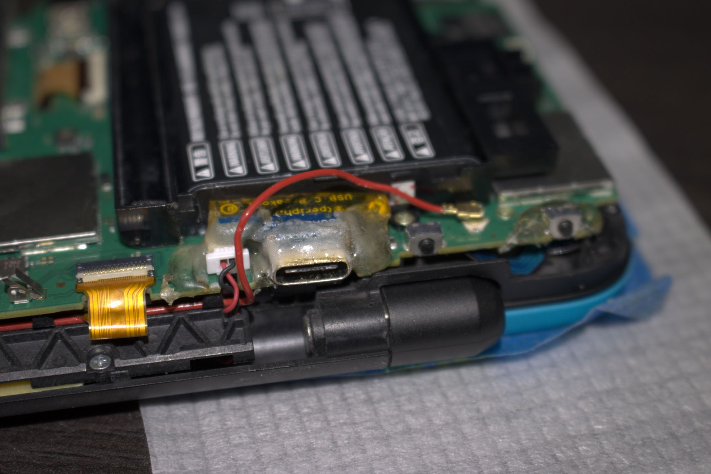

Replaced the proprietary charging port on my New 2DS XL with a USB-C
port ([Adafruit USB-C breakout board](https://www.adafruit.com/product/4090)).
The exterior of the port was sealed with
[Sugru](https://www.amazon.com/Sugru-Moldable-Glue-Original-Formula/dp/B007VXJM58).

The breakout board was trimmed and reinforced with epoxy and hot glue.

Was it worth the effort just to have one less charging cable? Absolutely.
